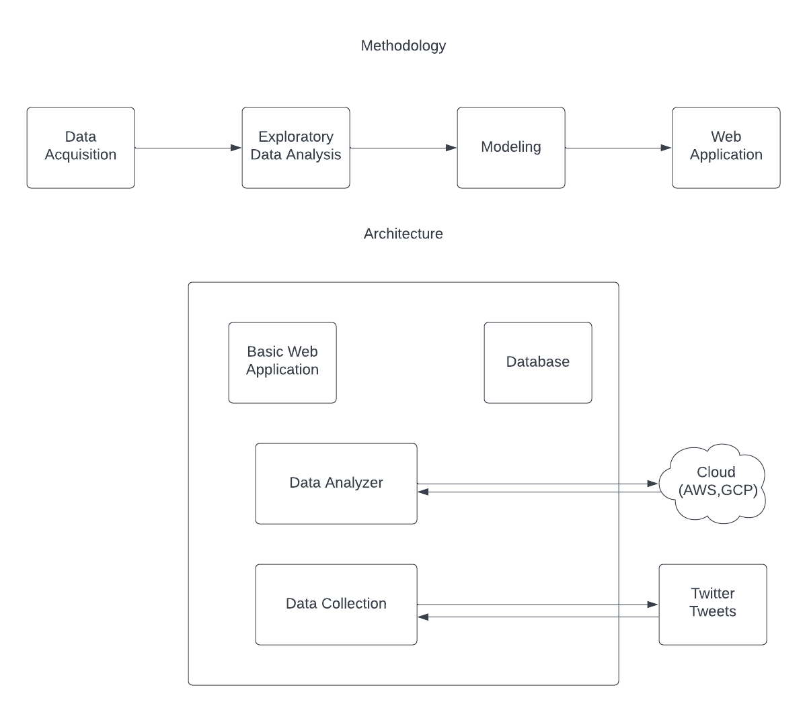

# Social Media Emergency Monitoring
A web application which monitors real-time social media data and alerts its users of impending emergencies in their area.
## Methodology and Architecture

## Pivotal Tracker Link
https://www.pivotaltracker.com/n/projects/2557033
